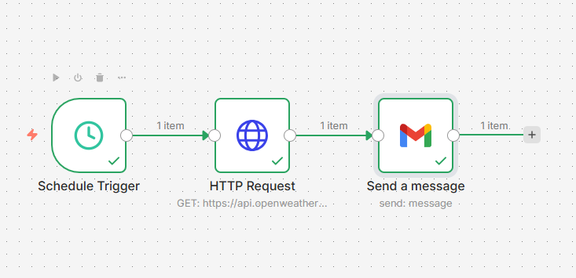
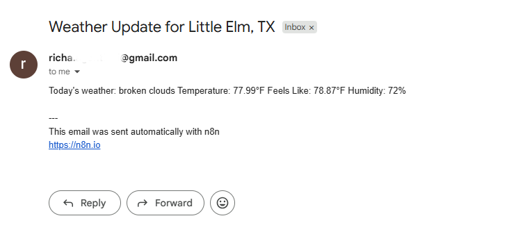

# 🔄Workflow Automation Projects (n8n)

> Real-world automation workflows integrating APIs, scheduling, and communication systems.

## 🎯 What This Is

A collection of practical automation workflows designed to solve real-world problems using n8n. These projects demonstrate API integration, data processing, and automated communication systems..

## 📊 Progress Tracker

| # | Project | Status | Concepts Learned |
|---|---------|--------|------------------|
| 01 | Daily Weather Alert to Email | 🟡 In Progress | Schedule Trigger, HTTP Request, Email Node |
| 02 | Google Sheet Lead Tracker | ⚪ Upcoming | Webhooks, Data Mapping, Google Sheets |
| 03 | RSS News Filter & Summary | ⚪ Upcoming | IF Conditions, Loops, Filtering |
| 04 | AI-Powered Email Responder | ⚪ Upcoming | AI Agent Node, OpenAI/Claude API |

## 🗂 Repo Structure

```
n8n-learning-journey/
├── index.html              # Learning tracker page (GitHub Pages)
├── README.md               # This file
├── workflows/              # Exported n8n workflow JSON files
│   ├── 01-weather-alert.json
│   ├── 02-lead-tracker.json
│   ├── 03-rss-filter.json
│   └── 04-ai-responder.json
└── notes/                  # Detailed learning notes
    └── day-01.md
```

## 🚀 Quick Start

1. **View the learning page:** GitHub Pages deployment available
2. **Import workflows:** Download any `.json` file from `/workflows` and import it into your n8n instance
3. **n8n Cloud:** [app.n8n.cloud](https://app.n8n.cloud) — Free trial with 1000 executions

## 📝Implementation Notes

- Designed a scheduled workflow using n8n
- Integrated external weather API (OpenWeatherMap)
- Processed API response and mapped required fields
- Automated email delivery using Gmail node
- Established end-to-end data flow between nodes

## 📸 Workflow Screenshot



> End-to-end automation: scheduled trigger → API integration → automated email delivery
> ## 📩 Sample Output



> Automated email generated from workflow execution

## 🛠 Tools & Stack

- **n8n Cloud** — Workflow automation
- **OpenWeatherMap API** — Weather data
- **Gmail** — Email delivery
- **GitHub Pages** — Hosting project showcase
- **OpenAI / Claude** — AI integration (Project 04)

## 📌 Resources

- [n8n Docs](https://docs.n8n.io/)
- [n8n Community Templates](https://n8n.io/workflows)
- [OpenWeatherMap API](https://openweathermap.org/api)

---

*Built as part of workflow automation solution development.*
